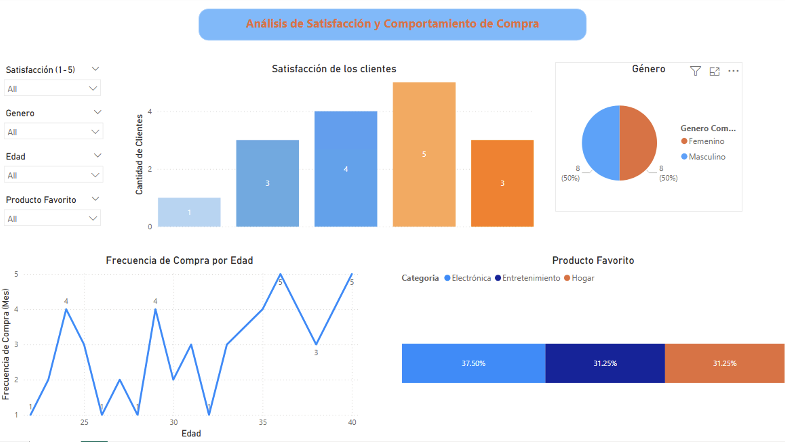

# 📊 Análisis de Satisfacción y Comportamiento de Compra

---

## 📋 Project Overview

This Power BI dashboard analyzes customer satisfaction and purchasing behavior data from a **local electronics store** in Costa Rica. The store conducted a customer survey to better understand their clientele and improve their marketing strategy and customer service.

---

## 🎯 Business Questions Answered

- What is the overall satisfaction level of customers?
- What is the gender distribution of the customer base?
- How does purchase frequency vary by age?
- Which product categories are most popular among customers?

---

## 📈 Key Insights

- 🟠 **Most customers are satisfied** — the majority rated their experience 4 or 5 out of 5
- 👥 **50/50 gender split** — equal distribution between male and female customers
- 🛍️ **Electrónica is the top category** — 37.50% of customers prefer electronics, followed by Entretenimiento and Hogar at 31.25% each
- 📊 **Purchase frequency varies by age** — customers in their mid-to-late 30s show the highest purchase frequency

---

## 🗂️ Dataset

**File:** `BD_Encuesta_Satisfacción.csv`

| Column | Description |
|--------|-------------|
| Cliente | Anonymous customer ID |
| Edad | Customer age |
| Género | Customer gender (M/F) |
| Satisfacción (1-5) | Satisfaction score 1-5 |
| Frecuencia de Compra (mensual) | Monthly purchase frequency |
| Ingreso Mensual (USD) | Monthly income in USD |
| Tipo de Producto Favorito | Favorite product category |
| Método de Pago Preferido | Preferred payment method |

- **Rows:** 16 customers
- **Source:** Customer satisfaction survey — local electronics store

---

## 📊 Dashboard Features

| Visual | Description |
|--------|-------------|
| 📊 Bar Chart | Customer satisfaction levels (1-5) |
| 🥧 Pie Chart | Customer proportion by gender |
| 📈 Line Chart | Purchase frequency evolution by age |
| 📊 Stacked Bar | Favorite product category distribution |
| 🎛️ Slicers | Filter by Satisfacción, Género, Edad, Producto Favorito |

---

## 🛠️ Tools Used

- **Power BI Desktop** — dashboard development
- **Power Query** — data cleaning and transformation
- **Conditional Column** — created full gender names (Masculino/Femenino)

---

## 📁 Files

| File | Description |
|------|-------------|
| `Lab_3_Jennifer_Arriola.pbix` | Power BI dashboard file |
| `BD_Encuesta_Satisfacción.csv` | Raw dataset |
| `powerbidashboard.png` | Dashboard preview |

---

## 👩‍💻 Author

**Jennifer Victoria Arriola Salazar**
- 🎓 Technical Certificate in Data Analytics — Universidad Cenfotec
- 💼 [LinkedIn](https://www.linkedin.com/in/jennifervictoriaarriolasalazar/)
- 🐙 [GitHub](https://github.com/jenvic96)
